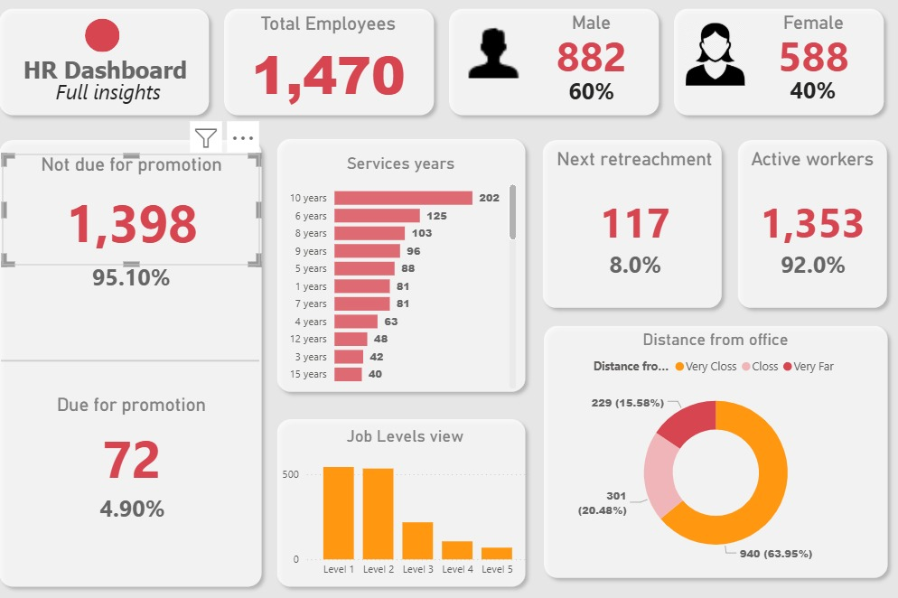

# HR Analytics Dashboard

## Overview

The HR Analytics Dashboard is a Power BI project designed to help Human Resource teams make data-driven decisions by analyzing workforce trends, employee demographics, attrition patterns, promotions, and departmental performance.

The dashboard transforms raw HR data into actionable insights through interactive visualizations and KPI tracking, enabling organizations to improve employee retention, workforce planning, and overall HR strategy.

---

## Features

### Workforce Overview

* Total Employees
* Active Employees
* Employee Distribution by Department
* Gender Diversity Analysis

### Attrition Analysis

* Overall Attrition Rate
* Attrition by Department
* Attrition by Age Group
* Attrition by Education Level
* Attrition by Job Role

### Employee Demographics

* Age Distribution
* Gender Distribution
* Education Background
* Marital Status Analysis

### Performance & Promotion Insights

* Promotion Eligibility Analysis
* Service Years Distribution
* Employee Experience Tracking
* Department-wise Performance Metrics

### Interactive Dashboard

* Dynamic Filters and Slicers
* Department-Level Drilldowns
* Visual KPI Monitoring
* User-Friendly Data Exploration

---

## Dashboard Insights

The dashboard helps answer key HR questions such as:

* Which departments have the highest attrition rates?
* What age groups are most likely to leave the organization?
* How does employee tenure impact retention?
* What is the gender distribution across departments?
* Which employees are eligible for promotion?

---

## Technologies Used

| Tool        | Purpose                     |
| ----------- | --------------------------- |
| Power BI    | Dashboard Development       |
| Excel       | Data Cleaning & Preparation |
| DAX         | KPI Calculations            |
| Power Query | Data Transformation         |

---

## Key Performance Indicators (KPIs)

* Employee Count
* Attrition Rate
* Active Workforce
* Average Service Years
* Promotion Eligibility
* Department Performance Metrics

---

## Project Workflow

1. Data Collection
2. Data Cleaning and Transformation
3. Data Modeling
4. DAX Measure Creation
5. Dashboard Design
6. KPI Visualization
7. Business Insight Generation

---

## Business Impact

This dashboard enables HR teams to:

* Monitor workforce health.
* Identify high-risk attrition areas.
* Improve employee retention strategies.
* Track diversity and inclusion metrics.
* Support strategic workforce planning.

---

## Dashboard Preview



```text
screenshots/
├── overview.png
├── attrition-analysis.png
├── demographics.png
└── performance-metrics.png
```

---

## Future Enhancements

* Predictive Attrition Analysis using Machine Learning.
* Employee Sentiment Analysis.
* Real-Time HR Data Integration.
* Advanced Workforce Forecasting.

---

## Author

Tanmay Jana

GitHub: https://github.com/dev-tanmay-jana

LinkedIn: https://www.linkedin.com/in/tanmay-jana-133606369/

Email: [tanmayjana074@gmail.com](mailto:tanmayjana074@gmail.com)

---

⭐ If you found this project useful, consider giving it a star.
